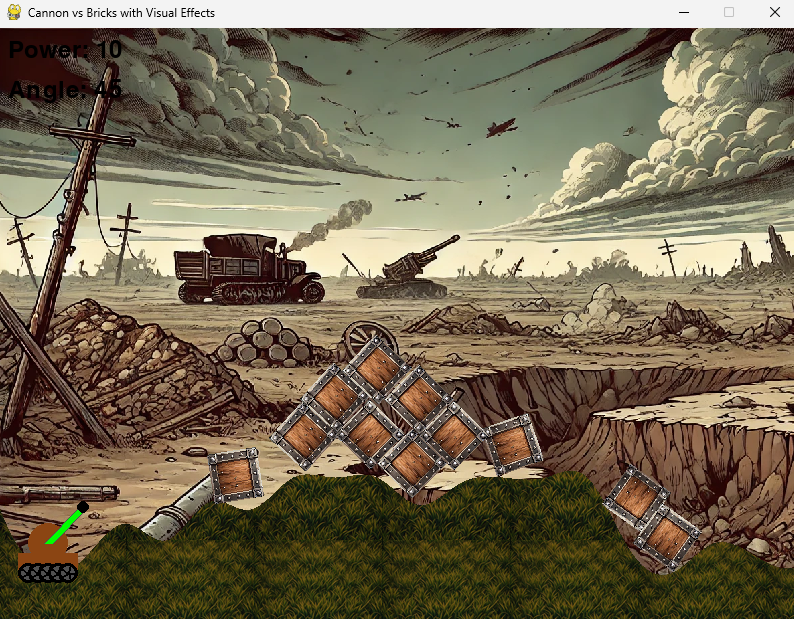
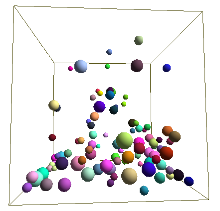
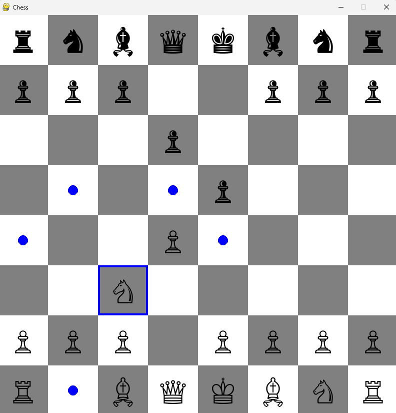

# AI Generated Test Apps

These are some simple apps generated with GPTo1

## CannonBallzzz
Using existing physics library

## Ballz
Here AI implemented collision detection and physics stuff from scratch.

## 3DPool

## Chess

## Crossword Generator

Try deployed version here => https://bizbas.com

# Notes

For python scipts install missing dependencies manually (if needed ask GPT4o how to do it)

